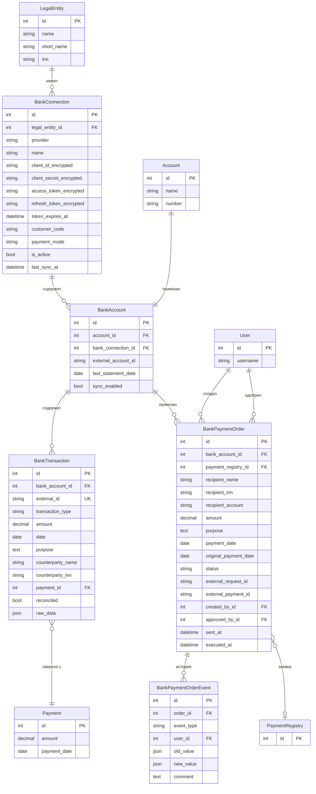
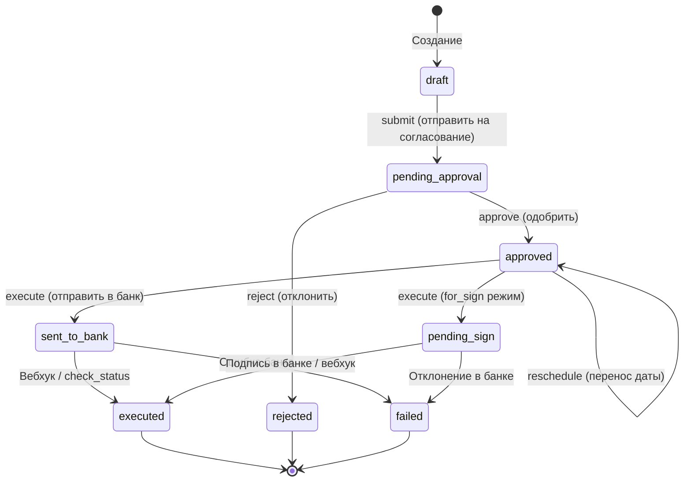
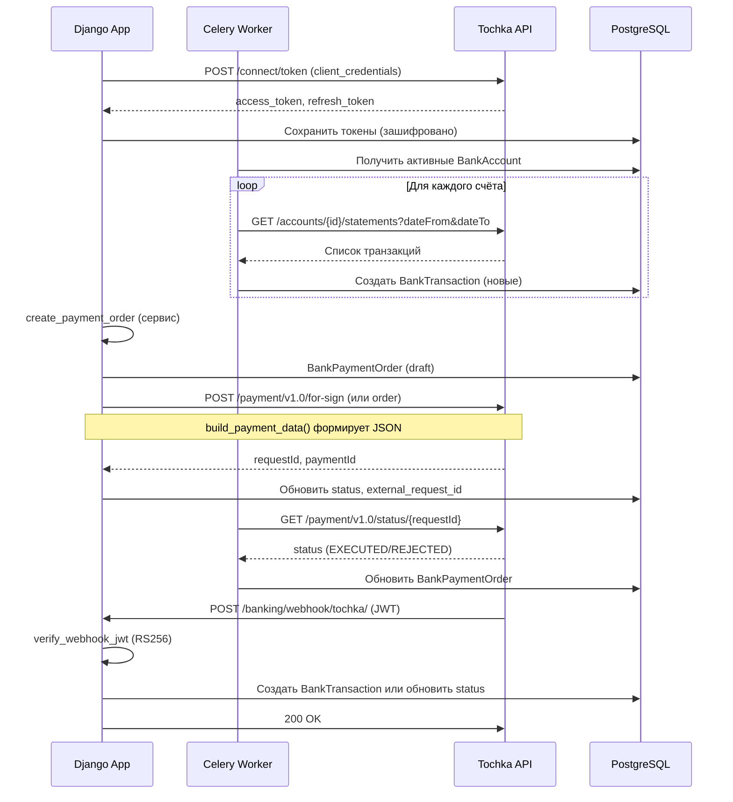

# Архитектура модуля banking

Модуль banking обеспечивает интеграцию с банковским API (Банк Точка) для синхронизации выписок, управления платёжными поручениями и автоматизации финансовых операций.

---

## 1. ER-диаграмма моделей



### Связи между моделями

| Модель | Связь | Описание |
|--------|-------|----------|
| **BankConnection** | legal_entity → LegalEntity | Подключение к банку принадлежит юрлицу |
| **BankAccount** | account → Account | Один внутренний счёт привязан к одному банковскому счёту |
| **BankAccount** | bank_connection → BankConnection | Счёт относится к подключению |
| **BankTransaction** | bank_account → BankAccount | Транзакция принадлежит банковскому счёту |
| **BankTransaction** | payment → Payment | Опциональная привязка к внутреннему платежу |
| **BankPaymentOrder** | bank_account → BankAccount | Счёт списания |
| **BankPaymentOrder** | payment_registry → PaymentRegistry | Опциональная заявка из реестра |
| **BankPaymentOrderEvent** | order → BankPaymentOrder | Аудит-лог каждого действия |

---

## 2. Жизненный цикл платёжного поручения (State Machine)



### Описание статусов

| Статус | Описание | Допустимые переходы |
|--------|----------|---------------------|
| **draft** | Черновик | → pending_approval |
| **pending_approval** | На согласовании | → approved, rejected |
| **approved** | Одобрено | → sent_to_bank, pending_sign, approved (reschedule) |
| **sent_to_bank** | Отправлено в банк (auto_sign) | → executed, failed |
| **pending_sign** | Ожидает подписи в интернет-банке | → executed, failed |
| **executed** | Исполнено | Финальный |
| **rejected** | Отклонено | Финальный |
| **failed** | Ошибка | Финальный |

---

## 3. Схема взаимодействия с Tochka API



---

## 4. Celery-задачи

### Расписание

| Задача | Интервал | Cron-эквивалент |
|--------|----------|-----------------|
| `sync_all_statements` | 30 мин | `*/30 * * * *` |
| `execute_scheduled_payments` | 15 мин | `*/15 * * * *` |
| `refresh_bank_tokens` | 12 часов | `0 */12 * * *` |
| `check_pending_payments` | 5 мин | `*/5 * * * *` |

### Описание задач

#### 4.1. sync_all_statements (каждые 30 мин)

**Назначение:** Синхронизация банковских выписок по всем активным счетам.

**Логика:**
1. Выбирает `BankAccount` с `sync_enabled=True` и `bank_connection__is_active=True`
2. Для каждого счёта вызывает `sync_statements(bank_account)`:
   - Период: `last_statement_date` или последние 30 дней → сегодня
   - Запрос к Tochka API: `GET /accounts/{id}/statements`
   - Парсинг транзакций, создание новых `BankTransaction` (по `external_id`)
   - Обновление `last_statement_date`, `last_sync_at`

**Обработка ошибок:** При исключении для конкретного счёта — логируется, остальные счета обрабатываются. Возвращает общее количество новых транзакций.

---

#### 4.2. execute_scheduled_payments (каждые 15 мин)

**Назначение:** Автоматическая отправка одобренных платежей, у которых наступила дата оплаты.

**Логика:**
1. Выбирает `BankPaymentOrder` со статусом `approved`, `payment_date <= today`
2. Для каждого вызывает `execute_payment_order(order)`:
   - Проверка статуса (должен быть `approved`)
   - Формирование данных через `build_payment_data()`
   - Вызов `create_payment_for_sign()` или `create_payment()` в зависимости от `payment_mode`
   - Обновление статуса на `sent_to_bank` или `pending_sign` (или `executed` при auto_sign)
   - Сохранение `external_request_id`, `external_payment_id`

**Обработка ошибок:** При `TochkaAPIError` — статус меняется на `failed`, ошибка сохраняется в `error_message`. При критической ошибке — логирование, переход к следующему платёжу.

---

#### 4.3. refresh_bank_tokens (каждые 12 часов)

**Назначение:** Проактивное обновление access_token для всех активных подключений.

**Логика:**
1. Выбирает `BankConnection` с `is_active=True`
2. Для каждого: `TochkaAPIClient(connection).ensure_valid_token()`:
   - Если токена нет — полная аутентификация
   - Если `token_expires_at` ближе 5 минут — обновление через `refresh_token`
   - Сохранение новых токенов в БД

**Обработка ошибок:** При ошибке для конкретного подключения — логирование, остальные обрабатываются. Токен можно будет обновить при следующем запросе к API (401 → authenticate).

---

#### 4.4. check_pending_payments (каждые 5 мин)

**Назначение:** Проверка статуса платежей, отправленных в банк, но ещё не исполненных.

**Логика:**
1. Выбирает `BankPaymentOrder` со статусом `sent_to_bank` или `pending_sign`
2. Для каждого вызывает `check_payment_order_status(order)`:
   - Запрос к Tochka API: `GET /payment/v1.0/status/{requestId}`
   - При `EXECUTED`/`COMPLETED`/`SUCCESS` → статус `executed`
   - При `REJECTED`/`DECLINED`/`FAILED` → статус `failed`

**Обработка ошибок:** При ошибке API — логирование, статус не меняется. Следующая проверка через 5 минут.

---

### Конфигурация в celery.py

```python
app.conf.beat_schedule = {
    'banking-sync-statements': {
        'task': 'banking.sync_all_statements',
        'schedule': 1800.0,  # 30 мин
    },
    'banking-execute-scheduled-payments': {
        'task': 'banking.execute_scheduled_payments',
        'schedule': 900.0,  # 15 мин
    },
    'banking-refresh-tokens': {
        'task': 'banking.refresh_bank_tokens',
        'schedule': 43200.0,  # 12 часов
    },
    'banking-check-pending-payments': {
        'task': 'banking.check_pending_payments',
        'schedule': 300.0,  # 5 мин
    },
}
```
