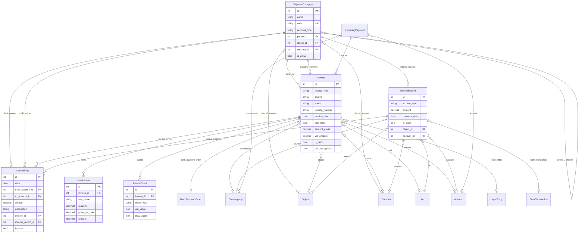
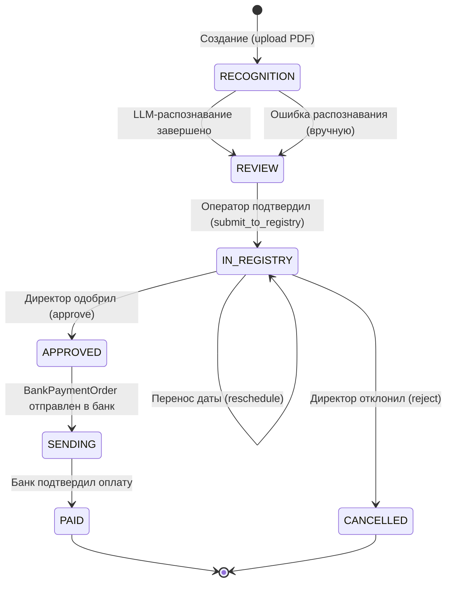
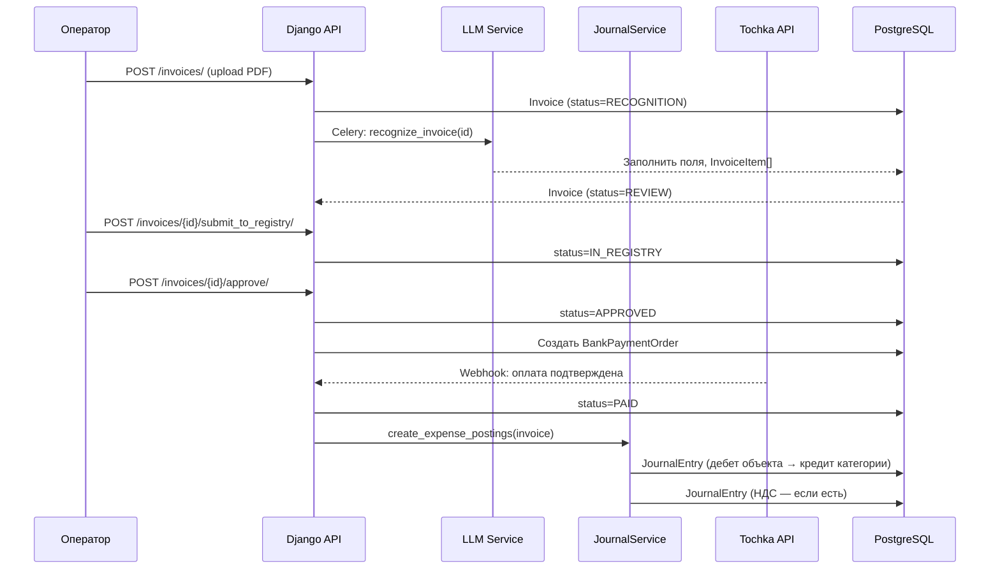
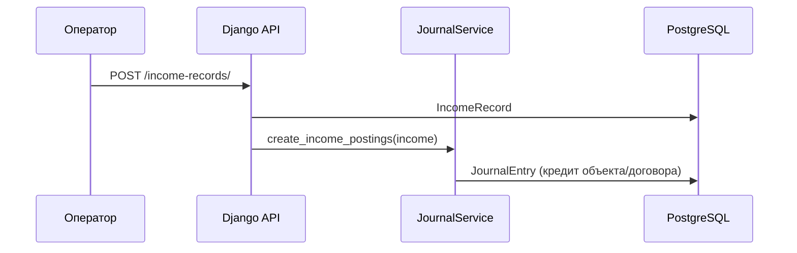
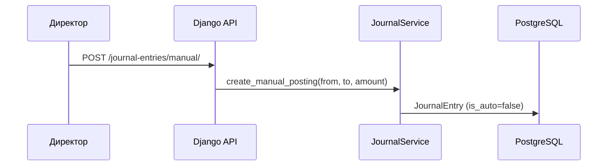

# Архитектура финансового модуля

**Файлы**: `backend/payments/`, `frontend/src/components/finance/`
**Обновлено**: Февраль 2026

---

## 1. ER-диаграмма моделей



### Связи между моделями

| Модель | Связь | Описание |
|--------|-------|----------|
| **ExpenseCategory** | object → Object | 1:1, виртуальный счёт объекта |
| **ExpenseCategory** | contract → Contract | 1:1, субсчёт договора |
| **ExpenseCategory** | parent → self | Иерархия (договор → объект) |
| **JournalEntry** | from_account → ExpenseCategory | Дебет (откуда списываются) |
| **JournalEntry** | to_account → ExpenseCategory | Кредит (куда зачисляются) |
| **Invoice** | category → ExpenseCategory | Категория расхода |
| **Invoice** | target_internal_account → ExpenseCategory | Целевой счёт (внутренние переводы) |
| **Invoice** | bank_payment_order → BankPaymentOrder | 1:1, платёжное поручение |
| **IncomeRecord** | bank_transaction → BankTransaction | Привязка к банковской транзакции |

---

## 2. Жизненный цикл счёта (Invoice State Machine)



### Описание статусов

| Статус | Описание | Кто переводит |
|--------|----------|---------------|
| **RECOGNITION** | PDF загружен, ожидает LLM-распознавания | Система (Celery) |
| **REVIEW** | Распознан, оператор проверяет данные | Оператор → submit_to_registry |
| **IN_REGISTRY** | В реестре оплат, ожидает согласования директором | Директор → approve / reject |
| **APPROVED** | Одобрен, BankPaymentOrder создан | Система → mark_sending |
| **SENDING** | Платёжное поручение отправлено в банк | Банк (webhook) → mark_paid |
| **PAID** | Оплачен. Создаются проводки | Финальный |
| **CANCELLED** | Отклонён директором | Финальный |

---

## 3. Потоки данных

### 3.1. Расходный поток (Invoice → JournalEntry)



### 3.2. Доходный поток (IncomeRecord → JournalEntry)



### 3.3. Ручная проводка



---

## 4. Архитектура frontend

```
App.tsx (Routes)
├── /finance/dashboard → FinanceDashboard
├── /finance/payments → PaymentsTabPage
│   ├── ?tab=invoices → InvoicesTab
│   │   └── InvoiceCreateDialog (modal)
│   ├── ?tab=registry → PaymentRegistryTab
│   │   └── ActionDialog (reject/reschedule)
│   └── ?tab=income → IncomingPaymentsTab
│       └── CreateIncomeDialog (modal)
├── /finance/instructions → MarkdownPage (finance.md)
│
│   Redirects:
├── /payments → /finance/payments?tab=invoices
└── /payment-registry → /finance/payments?tab=registry
```

### Используемые технологии

| Библиотека | Назначение |
|-----------|-----------|
| TanStack Query | Кэширование API-запросов, invalidation |
| Radix UI (Tabs, Dialog, Select, Switch) | UI-компоненты |
| Tailwind CSS | Стилизация |
| Lucide Icons | Иконки |
| Sonner | Toast-уведомления |
| react-router | Маршрутизация, query params для табов |

---

## 5. Сигналы (Django Signals)

**Файл**: `backend/payments/signals.py`

| Signal | Sender | Действие |
|--------|--------|----------|
| `post_save` | `objects.Object` | Создаёт `ExpenseCategory(account_type='object')` |
| `post_save` | `contracts.Contract` | Создаёт `ExpenseCategory(account_type='contract')`, parent = счёт объекта |

Сигналы импортируются в `PaymentsConfig.ready()` (`apps.py`).

---

## 6. Миграции

| Миграция | Описание |
|----------|----------|
| `0012_finance_internal_accounts_journal.py` | Новые поля в ExpenseCategory, Invoice, IncomeRecord; модель JournalEntry |
| `0013_create_system_accounts.py` | Data migration: создание profit, working_capital, vat |
