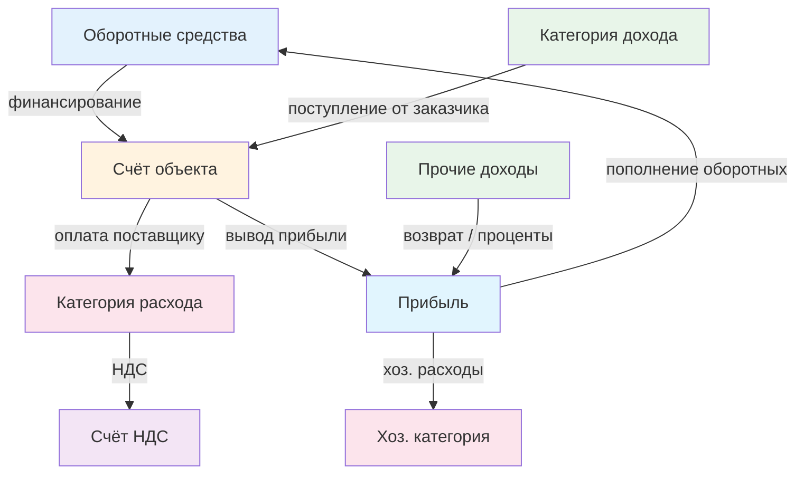

# JournalService — система проводок (двойная запись)

**Файл**: `backend/payments/journal_service.py`
**Обновлено**: Февраль 2026

---

## Концепция

Система проводок реализует упрощённую модель двойной записи для внутреннего учёта.

Каждая проводка (`JournalEntry`) представляет перемещение средств между двумя счетами Внутреннего плана счетов (`ExpenseCategory`):

- `from_account` — **дебет**: откуда списываются средства (баланс уменьшается)
- `to_account` — **кредит**: куда зачисляются средства (баланс увеличивается)

### Формула баланса

```
Баланс счёта = Σ(credit_entries.amount) − Σ(debit_entries.amount)
```

Реализация в `ExpenseCategory.get_balance()`.

---

## Системные счета

Создаются при первой миграции (`0013_create_system_accounts.py`):

| Код | Название | Назначение |
|-----|----------|-----------|
| `profit` | Прибыль | Аккумулирует прибыль, хоз. расходы списываются с этого счёта |
| `working_capital` | Оборотные средства | Свободные средства для финансирования объектов |
| `vat` | НДС | Учёт входящего/исходящего НДС |

---

## Виртуальные счета

### Счета объектов (auto-created)

При создании `Object` автоматически (через signal) создаётся:

```
ExpenseCategory(
    code='obj_{pk}',
    name='Объект: {name}',
    account_type='object',
    object=instance,
)
```

Баланс счёта объекта показывает, сколько средств доступно на данном объекте.

### Субсчета договоров (auto-created)

При создании `Contract` автоматически создаётся:

```
ExpenseCategory(
    code='contract_{pk}',
    name='Договор: {number}',
    account_type='contract',
    contract=instance,
    parent=<счёт объекта>,   # если contract.object задан
)
```

---

## API сервиса

### JournalService.create_expense_postings(invoice, user)

Создаёт проводки при оплате Invoice. Вызывается при переходе в статус `PAID`.

**Логика по типам:**

| Тип Invoice | from_account | to_account | Описание |
|-------------|-------------|-----------|----------|
| `supplier` | Счёт объекта/договора | Категория расхода | Деньги уходят с объекта |
| `act_based` | Счёт объекта/договора | Категория расхода | Оплата по акту |
| `warehouse` | Счёт объекта/договора | Категория расхода | Закупка на склад |
| `household` | Прибыль (`profit`) | Категория хоз. расхода | Хоз. расходы из прибыли |
| `internal_transfer` | category | target_internal_account | Прямой перевод |

**Дополнительная НДС-проводка** (если `invoice.vat_amount > 0`):

| from_account | to_account | amount |
|-------------|-----------|--------|
| Категория расхода | НДС (`vat`) | vat_amount |

**Пример**: Оплата счёта поставщика на 120 000₽ (с НДС 20 000₽) для объекта "ЖК Солнце":

```
Проводка 1: Объект: ЖК Солнце → Стройматериалы    120 000₽
Проводка 2: Стройматериалы    → НДС                 20 000₽
```

Результат:
- Баланс объекта: −120 000₽
- Баланс категории "Стройматериалы": +100 000₽
- Баланс НДС: +20 000₽

---

### JournalService.create_income_postings(income_record, user)

Создаёт проводки при поступлении средств.

**Логика по типам:**

| Тип IncomeRecord | from_account | to_account | Описание |
|-----------------|-------------|-----------|----------|
| `customer_act` | Категория дохода | Счёт объекта/договора | Поступление на объект |
| `advance` | Категория дохода | Счёт объекта/договора | Аванс на объект |
| `warranty_return` | Категория дохода | Счёт объекта/договора | Возврат гарантии |
| `supplier_return` | Категория дохода | Прибыль (`profit`) | Возврат от поставщика |
| `bank_interest` | Категория дохода | Прибыль (`profit`) | Проценты банка |
| `other` | Категория дохода | Прибыль (`profit`) | Прочие поступления |

**Пример**: Оплата от заказчика по акту на 500 000₽:

```
Проводка: Категория "Выручка" → Объект: ЖК Солнце    500 000₽
```

Результат: баланс объекта +500 000₽.

---

### JournalService.create_manual_posting(from_account, to_account, amount, description, user, posting_date)

Ручная проводка для внутренних переводов.

**Типичные сценарии:**

| Операция | from_account | to_account |
|----------|-------------|-----------|
| Вывод прибыли с объекта | Счёт объекта | Прибыль |
| Финансирование объекта | Оборотные средства | Счёт объекта |
| Пополнение оборотных | Прибыль | Оборотные средства |
| Межобъектный перевод | Счёт объекта A | Счёт объекта B |

**Валидация**: `from_account ≠ to_account` (иначе `ValueError`).

Все ручные проводки создаются с `is_auto=False`.

---

### JournalService.check_object_balance(obj, required_amount)

Проверка достаточности средств на виртуальном счёте объекта.

**Параметры:**
- `obj` — экземпляр `Object`
- `required_amount` — требуемая сумма (`Decimal`)

**Возвращает:**
```python
{
    'sufficient': bool,      # Достаточно ли средств
    'balance': Decimal,       # Текущий баланс
    'deficit': Decimal,       # Дефицит (0 если достаточно)
}
```

Используется в API-endpoint `GET /invoices/check_balance/` и во фронтенде при создании счёта типа `supplier` или `act_based`.

---

### JournalService.get_account_balance(account)

Обёртка над `ExpenseCategory.get_balance()`.

---

## Вспомогательные функции

### _get_system_account(code)

Получить системный счёт по коду (`profit`, `working_capital`, `vat`).
Возвращает `None` если не найден (логирует ошибку).

### _get_object_account(obj)

Получить или создать виртуальный счёт объекта.
Используется `get_or_create` — идемпотентно.

### _get_contract_subaccount(contract)

Получить или создать субсчёт договора.
Автоматически устанавливает `parent = счёт объекта`.

---

## Диаграмма потоков проводок



---

## Атомарность и безопасность

- Все методы обёрнуты в `@transaction.atomic` — либо все проводки создаются, либо ни одна.
- Проводки с `from_account_id == to_account_id` игнорируются (не сохраняются).
- Проводки с нулевой суммой не создаются.
- Валидация `clean()` на уровне модели запрещает одинаковые `from_account` и `to_account`.
