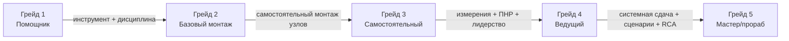

# Практико-ориентированная матрица компетенций монтажников инженерных систем в РФ

## Ключевые выводы

Практика монтажа ОВиК и систем безопасности в российских проектах значительно «богаче» формальных разрядных описаний, потому что ключевые риски лежат не в «умении прикрутить», а в контроле качества скрытых операций и измерениях: герметичность (ОВиК/холод), аэродинамика и сценарии противодымной защиты (вентиляция/ДУ), топология и тестирование линий связи (RS‑485/СКС) и корректная первичная конфигурация оборудования (ОПС/СКУД/VMS). Это подтверждается тем, что в руководствах производителей отдельными блоками описаны продувка азотом, испытания на утечки, вакуумирование и контроль удержания вакуума (для кондиционирования/VRF), а для ПДЗ/ДУ — требования к измерениям скоростей/давлений специализированными приборами и к квалификации персонала для электроподключений. citeturn2view0turn9view1turn15view0turn13view2turn14view2

Для кондиционирования (сплит/мульти/канальные/VRF/чиллер‑фанкойл) «граница зрелости» монтажника — это переход от механического монтажа к контролируемому холодильному циклу: пайка с азотной продувкой (антиокалина), опрессовка азотом с выдержкой/поправкой на температуру, вакуумирование (включая проверку удержания), дозаправка по массе и корректная электрика/дренаж. Это прямо отражено в инструкциях (например, запрет «выгонять воздух хладагентом», требование вакуумного насоса, регламенты опрессовки и удержания вакуума/давления). citeturn2view0turn9view1turn4search0turn15view0

Для вентиляции (общеобмен + дымоудаление) ключевой «порог» — переход от сборки воздуховодов к обеспечению герметичности, подвесов/креплений, сервисности, а затем — к измерениям, балансировке и сценарным испытаниям противодымной защиты (включая клапаны ДУ/ОЗК и дымовые вентиляторы). Практические документы по монтажу прямо фиксируют требования к фланцам/болтам/уплотнениям и запрет типичных ошибок (например, крепить подвесы к фланцам, «прятать» фланцы в стены), а документы по испытаниям — перечень приборов (дифманометры, крыльчатые анемометры и др.). citeturn12view0turn11view0turn13view2turn10view0

В слаботочных системах (ОПС, СОУЭ, СКУД, СКС, СОТ/video) «практический разряд» держится на умении предотвращать системные дефекты: неправильная топология RS‑485, отсутствие выравнивания потенциалов, тестирование кабельной инфраструктуры «для галочки», подключение тестеров к активной сети, некорректное питание/PoE‑бюджет и первичная настройка контроллеров/серверов. Это отражено и в монтажных инструкциях (например, рекомендации по «шине» RS‑485 и обязательности витой пары на длинных участках), и в руководствах кабельных анализаторов (предупреждения о подключении к активной сети, базовая логика «канал/постоянная линия», отчётность). citeturn20view0turn19view0turn17search1turn6search19

## Источниковая база и принципы построения матрицы

Матрица построена **не по ЕТКС/профстандартам**, а как «карта практики»: операции → контроль/измерение → критерии приемки → типичные дефекты → уровень ответственности. Основные типы источников (русскоязычные и применимые на российском рынке):
- Руководства производителей ОВиК и холодоснабжения: пайка с азотной продувкой, продувка/осушка, испытания на герметичность и вакуумирование, правила хранения/заглушки труб, предупреждения по безопасности. citeturn15view0turn2view0turn9view1turn4search0  
- Руководства производителей вентиляции и ПДЗ: монтаж дымовых вентиляторов, требования к установке/подключению, проверки перед запуском; инструкции по клапанам дымоудаления (в т.ч. требования к квалифицированному электрику и риски поражения током). citeturn10view0turn14view2turn14view0  
- Практические документы по монтажу воздуховодов: правила соединений на шинорейке, уплотнение лентой/герметиком, требования к затяжке болтов и расположению гаек, узлы крепления и типовые запреты. citeturn11view0turn12view0  
- Материалы по испытаниям/измерениям ПДЗ: перечень измерительной аппаратуры (дифманометры, крыльчатые анемометры и т.д.) и логика измерительных участков. citeturn13view2  
- Документация и обучение по слаботочке: монтажные инструкции и требования к электробезопасности/обесточиванию, рекомендации по топологии RS‑485; программы обучения по СКС и сертификации инсталляторов; руководства по кабельной сертификации и отчётности. citeturn20view0turn17search1turn19view0  
- Обучающие программы вендоров/учебных центров и практические курсы: акценты на реальных операциях (опрессовка азотом, вакуумирование, настройка адресов/ПНР, тестирование). citeturn5search1turn5search24turn6search1turn6search11  
- Профессиональные форумы как источник «типичных ошибок» и неформальных соглашений (используются как вспомогательные, не как единственный авторитет). citeturn4search10turn7search15  

Чтобы явно «заякорить» российский контекст, в навыки включены: работа с документацией/актами скрытых работ/испытаний (типовая практика генподряда), базовые допуски по электробезопасности (например, требование группы не ниже II для монтажа отдельных устройств), а для ПДЗ — сценарные проверки совместно с ОПС/СОУЭ/ДУ. citeturn20view0turn10view0turn13view2

Ключевые производственные источники, на которых опирается детализация навыков (упомянуты как «репрезентативные»): entity["company","Daikin","hvac manufacturer"], entity["company","Fujitsu","electronics hvac brand"], entity["company","Systemair","ventilation manufacturer"], entity["company","TROX","hvac fire safety firm"], entity["company","Fluke Networks","cable test equipment"], entity["company","LANMASTER","structured cabling brand"], entity["company","НВП «БОЛИД»","fire alarm manufacturer"], entity["company","TRASSIR","video surveillance vms"], entity["company","Sigur","access control vendor"], entity["company","IronLogic","access control maker"], entity["company","PERCo","turnstile skud maker"], entity["company","Avigilon","video security company"], entity["company","Axis","network camera maker"], а также профильные форумы entity["organization","FORUMHOUSE","construction forum"] и entity["organization","Mastergrad","repair forum"]. citeturn15view0turn9view1turn10view0turn14view2turn19view0turn17search1turn20view0turn6search19

## Сквозная модель грейдов и траектория роста

**Грейды 1–5** — это не «формальные разряды», а практические уровни самостоятельности и ответственности (с единым смыслом для трёх классов систем):

**Грейд 1 (помощник/ученик)** — выполняет подготовку, подачу материалов, простые операции по шаблону; не отвечает за скрытые работы и критические соединения.  
**Грейд 2 (монтажник базового уровня)** — делает типовой механический/кабельный монтаж по чертежу под контролем; умеет базовый инструмент, но критические испытания/настройки — не его зона ответственности.  
**Грейд 3 (самостоятельный монтажник)** — ведёт типовой участок «от разметки до первичного запуска/проверок», выполняет ключевые испытания средней сложности (вакуум/опрессовка, базовые сетевые/кабельные тесты, первичная конфигурация), оформляет базовую исполнительную документацию.  
**Грейд 4 (старший/ведущий)** — берёт «сложные узлы» и интеграции, организует измерения/балансировку, ПНР на уровне монтажной организации, принимает решения на площадке, руководит бригадой/подрядчиками.  
**Грейд 5 (мастер/прораб/ведущий по ПНР)** — отвечает за системный результат и сдачу: сценарные испытания ПДЗ/безопасности, устранение системных дефектов, управление качеством, обучение и стандартизация.

Визуализация прогрессии (типовая траектория роста, ориентирована на практику и экзамены):

Сравнение «что считается достаточным» по грейдам в трёх системах (короткая таблица‑ориентир):

| Грейд | Вентиляция (в т.ч. ДУ) | Кондиционирование/холод | Слаботочка |
|---|---|---|---|
| 1 | Подготовка, подача воздуховодов/крепежа, сборка «на полу» | Подготовка трассы/крепежа, помощь при установке блоков | Прокладка кабеля/лотков, маркировка под надзором |
| 2 | Монтаж подвесов, сборка фланцев/шинорейки, решётки/диффузоры | Установка внутренних/наружных блоков; развальцовка (типовая); изоляция | Оконцовка витой пары, монтаж простых устройств ОПС/СКУД, первичная прозвонка |
| 3 | Самостоятельный монтаж участка; первичные проверки; базовая регулировка | Пайка под азотом, опрессовка, вакуумирование, заправка; тест‑пуск | Сертификация СКС/базовые сети; установка IP‑камер и базовая настройка; адресация ОПС |
| 4 | Клапаны ДУ/ОЗК, электрика, измерения/балансировка (TAB‑уровень), интеграция с ОПС | VRF магистрали + адресация/ПНР; обвязка фанкойлов/ПУ; базовая автоматика | ПНР ОПС+СОУЭ; администрирование VMS/СКУД; ВОЛС/OTDR; диагностика RS‑485 |
| 5 | Сценарные испытания ПДЗ и протоколы; устранение системных дефектов | Комплексная диагностика VRF/чиллер‑фанкойл; сдача и обучение эксплуатации | Интеграции «по зданию», комплексные испытания и сдача |

## Вентиляция и дымоудаление

### Практические «ядра компетенций» отрасли

Вентиляционный монтаж в реальных проектах делится на 4 практических ядра: (1) **механика и геометрия** (подвесы, уклоны, сервисный доступ), (2) **герметичность и вибрации** (шины/фланцы, уплотнения, гибкие вставки, шумоглушение), (3) **электрика и управление** (вентустановки, приводы клапанов, межсистемные сигналы), (4) **измерения и сценарии** (расход/давление, балансировка, противодымные сценарии). Это отражается и в практических требованиях к сборке соединений (уплотнительная лента/герметик, болтовые соединения), и в типовых ППР/техкартах, и в методиках испытаний ПДЗ, требующих дифманометры и крыльчатые анемометры. citeturn11view0turn12view0turn13view2

Для дымоудаления критична «пожарная логика»: правильная установка дымовых вентиляторов (вертикальность, основание, проверки перед запуском, направление вращения, требование обученного персонала для электроподключений), а также корректный монтаж клапанов ДУ и электробезопасность при подключениях. citeturn10view0turn14view2turn7search19

### Матрица грейдов для вентиляции и дымоудаления

| Грейд | Типовые задачи/операции | Инструмент и измерения | Требуемые знания (теория) | Безопасность/допуски | Качество/приёмка | Типичные ошибки и устранение | Примеры должностей |
|---|---|---|---|---|---|---|---|
| 1 | Приёмка/перемещение воздуховодов и фасонины; сборка простых узлов на полу; подача крепежа | Рулетка, маркер, ножницы по металлу, клепальник (под надзором) | Базовые виды воздуховодов/фасонины; маркировка | ОТ на объекте, СИЗ | Нет повреждений/вмятин; комплектность; чистота | Потеря крепежа/прокладок → контроль комплектов; повреждение оцинковки → замена/ремонт | Подсобный рабочий, ученик монтажника |
| 2 | Подвесы/траверсы, анкеровка; сборка прямоугольных воздуховодов на шинорейке; монтаж решёток/диффузоров | Перфоратор, лазер/уровень; ключи М8/М10; герметик/лента | Типовые соединения (шинорейка/фланцы); смысл уплотнения; допуски по геометрии | Работы на высоте (по правилам объекта) | Уплотнение по периметру рамки; корректные болты/гайки; запрет «прятать» фланцы в стены; затяжка болтов до отказа, расположение гаек с одной стороны фланца | Нет ленты/герметика → разбор/уплотнение; подвес к фланцу → переделка; слабая затяжка → подтяжка/замена крепежа | Монтажник вентиляции (нач.), монтажник воздуховодов |
| 3 | Самостоятельный монтаж участка по аксонометрии; монтаж вентиляторов/шумоглушителей/фильтров; утепление; первичные проверки (вращение, вибрации, шум) | Динамометрические ключи (по необходимости); базовый мультиметр; дым‑карандаш (подсосы), ручной анемометр (скрининг) | Чтение схем ОВ; причины шума/вибрации; конденсат и уклоны | Электробезопасность при подключениях в зоне ответственности | Герметичность стыков, отсутствие «провисов», сервисные люки доступны; перед запуском: проверить крепление, герметичность соединений, отсутствие посторонних предметов, направление вращения | Подсосы на стыках → повторная герметизация; обратное вращение → перестановка фаз; вибрации → вибровставки/центровка/усиление основания | Монтажник вентиляции, монтажник ОВиК |
| 4 | Дымоудаление: монтаж дымовых вентиляторов, огнестойкие соединения; монтаж/подключение клапанов ДУ/ОЗК; измерения расхода/ΔP и базовая балансировка | Дифманометр, трубка Пито/приемник давления, крыльчатый анемометр; токоизмерительные клещи | Основы TAB; логика «исходного положения» клапанов (ОЗК открыто, ДУ закрыто); сценарии ПДЗ | Квалиф. электрик для ряда подключений; управление рисками ПДЗ | Измерения выполняются приборами (дифманометр класс точности и крыльчатый анемометр), фиксируются точки; корректная работа привода/концевиков; соответствие монтажного положения | Перепутаны концевики/логика → прозвон/перекоммутация; неверное «исходное положение» → перенастройка привода; «звезда» RS‑485 управления приводами без согласования → переразводка (если применимо) | Старший монтажник, бригадир ОВиК, наладчик участка |
| 5 | Сценарные испытания ПДЗ (связка ОПС↔ДУ), оформление протоколов; устранение системных дефектов (невыдержан расход/давление, шум, подсосы) | Комплект измерений + протоколы; средства диагностики вибраций/электрики (по объекту) | Системная диагностика: причина‑следствие; взаимодействие систем здания | Наряд‑допуски по объекту; ответственность за сдачу | Полный цикл: измерения → корректировки → повторные измерения → протокол/акт | «Лечат» расход одним анемометром без давления/сопротивлений → корректировать методику измерений; игнор подсосов/обратных клапанов → локализация, переработка узлов | Мастер/прораб ОВиК, ведущий по ПНР ПДЗ |

Практическая опора для критериев герметизации/фланцев/подвесов и типовых запретов приведена в рекомендациях по шинорейке и ППР (уплотнительная лента/герметик; болтовые соединения М8/М10; «болты затянуты до отказа», «гайки с одной стороны», запрет крепления подвесов к фланцам). citeturn11view0turn12view0  
Для измерений и приемки ПДЗ (в части приборов) — дифманометры, крыльчатые анемометры, требования к точкам измерения и оснащению стенда/методики. citeturn13view2  
Для дымовых вентиляторов — требования к вертикальной установке, проверкам перед запуском и квалификации персонала для электроподключения. citeturn10view0  
Для клапанов дымоудаления — требование «прочитать руководство до работ», а также требование квалифицированного электрика и предупреждения по электробезопасности. citeturn14view0turn14view2  
Для логики исходных положений ОЗК/ДУ в «дежурке» (как типовой практический чек) — разбор настройки управления клапанами. citeturn7search19

## Кондиционирование и холодоснабжение

### Практические «ядра компетенций» отрасли

Для кондиционирования (от сплит‑систем до VRF и чиллер‑фанкойл) главный принцип практики: **чистота + осушка + герметичность** = ресурс компрессора и отсутствие «плавающих» неисправностей. Это в явном виде формулируется в монтажных руководствах: хранить трубы заглушенными, продувать азотом при пайке для предотвращения оксидной пленки, продувать/очищать трассу, выполнять испытание на герметичность и вакуумирование, причём запрещается «выгонять воздух хладагентом». citeturn15view0turn2view0turn9view1turn4search0

Для практического грейдинга важно разделять два класса компетенций:
- **механический монтаж** (крепеж, уровни, трасса, дренаж, электрика),
- **холодильный контур** (пайка/развальцовка, опрессовка/вакуум/заправка, контроль утечек и влаги).

Именно вторая часть чаще всего является «скрытой» и даёт основную цену дефектов. Например, в руководстве VRV описывается вакуумирование до порядка −100,7 кПа (−1,007 бар / 5 torr) с выдержками, а также испытание на герметичность и нарушение вакуума азотом с ограничением давления. citeturn2view0

### Матрица грейдов для кондиционирования

| Грейд | Типовые задачи/операции | Инструмент и измерения | Требуемые знания (теория) | Безопасность/допуски | Качество/приёмка | Типичные ошибки и устранение | Примеры должностей |
|---|---|---|---|---|---|---|---|
| 1 | Подготовка места: отверстия/гильзы, кронштейны, кабель‑каналы; помощь при подъёме/такелаже | Перфоратор, базовый ручной инструмент | Базовая компоновка сплит/канальных систем; требования к доступу | ОТ/СИЗ; работы на высоте по правилам объекта | Геометрия крепежа; отсутствие повреждений трассы | Неправильная отметка отверстия → переделка; отсутствие уклона дренажа «сразу» → исправление до закрытия отделкой | Помощник монтажника кондиционеров |
| 2 | Монтаж внутренних/наружных блоков; развальцовка типовых соединений; теплоизоляция трассы/дренажа | Труборез, развальцовка, динамометрический ключ (желателен), уровень; вакуумный насос/коллектор (под контролем старшего) | Требования к чистым трубам и материалам; особенности R410A (высокое давление) | Электробезопасность при подключениях; безопасный подъём/крепление НБ | Ровность установки; правильная толщина/целостность изоляции; корректный крепёж; отсутствие перетираний кабеля | Плохая развальцовка/перетяжка → повтор, контроль момента; разрывы изоляции → переизоляция до пуска | Монтажник сплит‑систем, монтажник ОВиК (нач.) |
| 3 | Пайка медных труб с азотной продувкой; опрессовка азотом; вакуумирование; заправка по массе/длине; тест‑пуск (сплит/мульти/канал) | Баллон N2 + редуктор; горелка/припой; манометрический коллектор; весы; вакуумный насос (двухступ.); детектор утечки; базовый мультиметр | Зачем азот при пайке (антиокалина); логика испытаний (давление/вакуум); как интерпретировать рост давления (влага vs утечка) | Огневые работы: запрет кислорода для продувки; огнетушитель рядом; работы с баллонами | Контур: опрессовка и выдержка; вакуумирование до заданного уровня и проверка удержания; отсутствие утечек; корректная дозаправка | Пайка без азота → окалина/риски компрессора → переделка; «выпуск воздуха хладагентом» → запрещено, повторная эвакуация; не заглушали трубы → загрязнение → продувка/перепайка по ситуации | Монтажник кондиционеров, монтажник VRF (типовые объекты) |
| 4 | VRF/VRV: refnet‑разветвители, маркировка магистралей, адресация и базовая ПНР; чиллер‑фанкойл/ПУ: обвязка, промывка, опрессовка водяного контура, базовая настройка сигналов | Доп. инструменты: вакуумметр (микрон‑метр), клещи токовые, набор для гидроиспытаний; ПО/сервисные утилиты вендора (по объекту) | Нормальная последовательность работ по трассе (пайка→продувка→герметичность→вакуум); принципы гидравлики фанкойлов (воздухоотвод/баланс) | Допуски по объекту; координация огневых и высотных работ | VRF: корректная магистраль и тест‑режимы; водяной контур: отсутствие течей, правильное заполнение/развоздушивание | Неверный монтаж refnet/диаметры → переделка; «плавающие» ошибки связи (VRF) из‑за кабеля/земли → диагностика и переразводка; фанкойл «воздух» → развоздушивание/баланс | Старший монтажник ОВиК, инженер‑монтажник VRF |
| 5 | Комплексная диагностика и сдача: устранение системных дефектов (влага, утечки, перегрев/переохлаждение, ошибки VRF), организация сдачи и обучение эксплуатации | Расширенная диагностика: чтение параметров/кодов, тренды, контрольные карты; (по компании) станция возврата хладагента | Причинно‑следственные цепочки дефектов; управление качеством и рекламациями | Ответственность за безопасность и качество; контроль субподрядов | Сдача с протоколами и устранением замечаний; повторные испытания после переделок | «Лечат» симптом (дозаправкой) без устранения влаги/утечек → возврат к вакуум/опрессовке; игнорируют правила хранения труб → системные загрязнения → регламент хранения и контроль | Мастер ОВиК, ведущий по ПНР/сервису |

Ключевые опорные фрагменты практики (и, соответственно, критерии для грейдов 3–4):
- **Специнструмент и цикл работ** для R410A: манометрический коллектор с диапазонами давления, двухступенчатый вакуумный насос, детектор утечки; вакуумирование до −0,1 МПа и проверка удержания; опрессовка с выдержкой (в одной из инструкций — повышение до 41,5 кг/см² и выдержка ≥24 ч для поиска мелких утечек, с поправкой на температуру). citeturn9view1  
- **VRF/VRV процедуры**: использовать вакуумный насос (не хладагент для вытеснения воздуха), вакуум‑тест/осушка и давление азотом с порогами и ограничениями, а также рекомендации по растворам для «пузырьковой» пробы. citeturn2view0  
- **Азот при пайке**: требование продувки азотом, чтобы предотвратить оксидную пленку; типовые давления продувки порядка 0,02 МПа (в разных руководствах встречается 0,02–0,03 МПа) и прямой запрет использовать кислород из‑за риска взрыва; рекомендация держать огнетушитель рядом при пайке. citeturn4search0turn15view0  
- **Практический порядок «очистить‑осушить‑герметизировать»** и требования к заглушке труб/хранению (в т.ч. на стройплощадке). citeturn15view0  
- Что работодатели в реальных вакансиях отдельно выделяют «опрессовку азотом» и «вакуумирование» как обязательные операции, подтверждая практическую значимость этих навыков. citeturn6search19  

## Слаботочные системы

### Практические «ядра компетенций» отрасли

В слаботочке важно отличать **монтаж линии** от **работоспособности системы**. На практике «системность» обеспечивают четыре ядра:
1) кабельная инфраструктура и трассы (лотки, радиусы, маркировка, шкафы),  
2) корректная топология и питание (RS‑485, PoE, резервирование),  
3) тестирование/сертификация (для СКС и ВОЛС, протоколы),  
4) первичная конфигурация и сценарии (ОПС/СОУЭ/СКУД/VMS).

Пример «практической нормы» — рекомендации по RS‑485: использование витой пары, предпочтительная топология «шина», допустимость небольших ответвлений и применение повторителей для длинных «лучей», а также требования по объединению «0 В» при разных источниках питания. Это критически влияет на квалификационное распределение задач (грейды 3–5). citeturn20view0

СКС как дисциплина часто «формализует» навыки через сертификацию: учебные центры вендоров прямо описывают программы подготовки сертифицированных проектировщиков/инженеров и выдают статус сертифицированного инсталлятора после экзамена, а кабельные анализаторы поддерживают сертификацию и отчётность по проектам. citeturn17search1turn19view0

### Матрица грейдов для слаботочных систем (ОПС, СОУЭ, СКУД, СКС, СОТ/video)

| Грейд | Типовые задачи/операции | Инструмент и измерения | Требуемые знания (теория) | Безопасность/допуски | Качество/приёмка | Типичные ошибки и устранение | Примеры должностей |
|---|---|---|---|---|---|---|---|
| 1 | Прокладка кабеля/гофры/лотков под надзором; подготовка отверстий/крепежа; маркировка «по списку» | Рулетка, маркер, стяжки, нож, перфоратор (под контролем) | Типы кабелей (витая пара/пожарный/коаксиал); аккуратность трасс | ОТ/СИЗ; работа на высоте по объекту | Нет перетираний/переломов; трасса закреплена; бирки читаемы | Слишком туго стяжки → ослабить/заменить; нарушение радиуса → переделка участка | Помощник слаботочника |
| 2 | Оконцовка витой пары (розетки/патч‑панели); монтаж извещателей/оповещателей/кнопок; простая «прозвонка» | Кримпер/нож IDC, тестер прозвонки, мультиметр | Распиновка; базовые шлейфы; аккуратная разделка | Электробезопасность на уровне работ; обесточивание перед подключениями | Правильная распиновка; крепёж устройств; отсутствие КЗ/обрывов | Пары «расплетены» слишком сильно → переделка; перепутан полюс питания → исправить, проверить устройство | Монтажник ОПС/СКС (нач.), инсталлятор (junior) |
| 3 | Сертификация СКС и отчёты; IP‑камеры: крепление, PoE/питание, базовая IP‑настройка; адресация и базовая конфигурация ОПС; СКУД «одна дверь» | Кабельный анализатор (канал/постоянная линия), PoE‑тестер, ноутбук; базовые сетевые утилиты | DHCP/статический IP; базовая логика «контроллер‑замок‑датчик»; понимание «шины» RS‑485 | Монтаж и ТО при отключенном питании; электробезопасность (не ниже II для ряда устройств) | Для RS‑485: витая пара и топология «шина»; для СКС: отчёт сертификации; для CCTV: стабильное питание и картинка без расфокуса | Подключили тестер к активной сети → риск ошибок/повреждений: повторить тест по правилам; «звезда» RS‑485 → переразводка/повторители; СКУД: перегруз реле замка → ставить промежуточное реле/подбирать БП | Монтажник СКС/видео, инженер‑инсталлятор (middle) |
| 4 | ПНР ОПС+СОУЭ (зоны/сценарии/проверка линий); администрирование VMS на уровне инсталлятора; ВОЛС (оконцовка/сварка/измерения); диагностика RS‑485 и помех | OTDR/OLTS (по задаче), анализ питания/земли, осциллограф (по компании) | Нагрузки БП, резервирование, помехоустойчивость; работа с журналами и событиями | Квалифицированные работы по внутренним регламентам; управление рисками пожарной автоматики | Протоколы ПНР/испытаний; корректная логика СОУЭ и связок; отчёты по ВОЛС/СКС | Неправильная топология/не объединён «0 В» → исправление по схеме; «плавающие» проблемы из‑за помех → экранирование/разнос/переразводка | Ведущий монтажник, инженер ПНР слаботочки |
| 5 | Интеграция систем безопасности здания (ОПС→ДУ/СКУД, СКУД↔VMS); комплексные испытания, сдача и обучение заказчика; план корректирующих работ | Комплекс тестов, журналы событий, сценарные чек‑листы | Системная архитектура: «событие→реакция→подтверждение»; причинный анализ дефектов | Ответственность за сдачу; управление допусками и рисками | Сценарные акты и журналы, закрытие замечаний | Интеграции сделаны «на месте» без документации → оформить, стабилизировать и повторно испытать; недостаточное питание/PoE → перерасчёт и модернизация | Мастер/прораб слаботочки, ведущий инженер по интеграции |

Опорные практические требования и «якоря» по источникам:
- Монтаж и безопасность/квалификация: монтаж/ТО при снятом питании и требование группы по электробезопасности не ниже II (на примере монтажной инструкции оборудования), а также рекомендации по RS‑485 (витая пара, «шина», ограничения по ответвлениям, повторители, длины). citeturn20view0  
- Сертификация и тестирование СКС: кабельные анализаторы поддерживают сертификацию и документирование, используют основной и удалённый блок, адаптеры канала/постоянной линии и формируют отчёты (через ПО LinkWare). citeturn19view0  
- Роль обучения/сертификации: программа учебного центра по СКС описывает сертификационные семинары (проектировщики/инженеры), ресертификацию и выдачу статуса сертифицированного специалиста по итогам экзамена. citeturn17search1turn17search3  
- Практика настройки СКУД: риск перегрузки реле контроллера при подключении электромагнитного замка (потребление до порядка 2 А у некоторых замков) и необходимость учитывать нагрузочную способность/правильное питание. citeturn8search2  
- Практика настройки контроллеров/ПО: программы обучения по СКУД включают подключение контроллера, первоначальную настройку и практику. citeturn6search1turn6search5  
- Практика VMS: актуальные версии ПО и поддержка Windows (как индикатор «живой» практики администрирования). citeturn6search19  
- Форумная практика как «база типовых ошибок»: обсуждения по подключению приводов клапанов/оконечным резисторам у производителей (важно для интеграции ОПС↔ДУ). citeturn7search15  

## Сводная ERP/HR-матрица и метрики насыщенности навыков

### Метрика «плотность навыков» по грейдам

Ниже — количественная оценка «плотности» (числа дискретных блоков компетенций) в сводной ERP‑матрице, чтобы HR/руководитель участка видел, что грейд‑3 и грейд‑4 обычно самые «насыщенные» по количеству проверяемых умений (именно там появляются измерения, ПНР и документация).

**Итого по всем доменам (83 блока):**  
Г1 = 6, Г2 = 15, Г3 = 27, Г4 = 21, Г5 = 14.

Визуальная диаграмма (чем длиннее полоса, тем больше блоков навыков в матрице):
- Г1: ██████  
- Г2: ███████████████  
- Г3: ███████████████████████████  
- Г4: █████████████████████  
- Г5: ██████████████  

Разбивка по доменам (кол-во блоков в матрице):

| Домен | Г1 | Г2 | Г3 | Г4 | Г5 | Итого |
|---|---:|---:|---:|---:|---:|---:|
| Общие | 2 | 3 | 4 | 3 | 3 | 15 |
| Вентиляция/Дымоудаление | 2 | 4 | 6 | 5 | 3 | 20 |
| Кондиционирование | 1 | 4 | 8 | 7 | 4 | 24 |
| Слаботочные | 1 | 4 | 9 | 6 | 4 | 24 |

Эти числа — **внутренняя метрика** (сколько блоков компетенций заложено в ERP‑таблицу ниже), а не «норма рынка».

### Сводная компетентностная матрица для ERP/HR

Правила использования в ERP/HR:
- «Мин. грейд» — уровень, на котором сотрудник может выполнять блок **самостоятельно** и нести ответственность за результат на участке.
- «Подтверждение» — минимальный формат проверки (наблюдение/практика/протокол).
- Рекомендуемый жизненный цикл: **первичная аттестация → допуск → переаттестация при смене типа систем/оборудования или после инцидентов/рекламаций**.

| ID | Домен | Мин. грейд (1–5) | Навык/операция (блок) | Подтверждение |
|---|---|---|---|---|
| G01 | Общие | 1 | Охрана труда на площадке: СИЗ, порядок допуска, уборка, ограждения | Наблюдение + чек-лист |
| G02 | Общие | 1 | Работа с ручным инструментом: отвертки, ключи, нож, маркер, рулетка | Наблюдение + чек-лист |
| G03 | Общие | 2 | Работа с электроинструментом (дрель/перфоратор) с пылеудалением; правильный подбор крепежа | Наблюдение + чек-лист |
| G04 | Общие | 2 | Чтение простых монтажных схем/планов, маркировка трасс по проекту | Наблюдение + чек-лист |
| G05 | Общие | 3 | Сдача скрытых работ: фотофиксация, исполнительные схемы (as-built) под руководством | Наблюдение + чек-лист |
| G06 | Общие | 3 | Организация рабочего места: 5S, учет инструмента/расходников, контроль брака | Наблюдение + чек-лист |
| G07 | Общие | 4 | Планирование работ участка, координация с смежниками, управление рисками и сроками | Наблюдение + чек-лист |
| G08 | Общие | 4 | Ведение комплектов ИД (исполнительная документация): акты, паспорта, протоколы испытаний | Практика + протокол/отчет |
| G09 | Общие | 5 | Техническое лидерство: разбор дефектов, RCA, обучение/наставничество, стандартизация работ | Наблюдение + чек-лист |
| G10 | Общие | 5 | Управление качеством монтажа: чек-листы, приемочный контроль, работа с рекламациями | Наблюдение + чек-лист |
| G11 | Общие | 2 | Работы на высоте: стремянки/вышки, страховка, организация зон под работами | Наблюдение + чек-лист |
| G12 | Общие | 3 | Базовые измерения мультиметром/токоизмерительными клещами; проверка цепей питания/PE | Практика + протокол/отчет |
| G13 | Общие | 3 | Огневые работы (пайка/сварка): обращение с баллонами N2/пропан/кислород, пожарный пост | Наблюдение + чек-лист |
| G14 | Общие | 4 | Чтение комплексных проектов, ведение 'красных линий', согласование отклонений | Наблюдение + чек-лист |
| G15 | Общие | 5 | Организация приемочных испытаний с заказчиком/эксплуатацией; управление замечаниями | Практика + протокол/отчет |
| V01 | Вентиляция/Дымоудаление | 1 | Комплектация и приемка воздуховодов/фасонины/крепежа на объекте | Наблюдение + чек-лист |
| V02 | Вентиляция/Дымоудаление | 1 | Сборка прямых участков воздуховодов на полу/стенде, клепка/саморезы под надзором | Наблюдение + чек-лист |
| V03 | Вентиляция/Дымоудаление | 2 | Монтаж подвесов/траверс, анкеровка, установка хомутов и опор | Наблюдение + чек-лист |
| V04 | Вентиляция/Дымоудаление | 2 | Сборка фланцевого соединения на шинорейке с уплотнением лентой/герметиком | Наблюдение + чек-лист |
| V05 | Вентиляция/Дымоудаление | 2 | Монтаж решеток/диффузоров/вентклапанов, регулировка простых заслонок | Наблюдение + чек-лист |
| V06 | Вентиляция/Дымоудаление | 3 | Чтение аксонометрии/изометрии вентиляции, разметка трасс, обход коллизий в рамках проекта | Наблюдение + чек-лист |
| V07 | Вентиляция/Дымоудаление | 3 | Монтаж ВУ/вентиляторов/шумоглушителей/фильтров, подключение вибровставок | Наблюдение + чек-лист |
| V08 | Вентиляция/Дымоудаление | 3 | Монтаж и теплоизоляция воздуховодов; узлы проходок, герметизация стыков | Наблюдение + чек-лист |
| V09 | Вентиляция/Дымоудаление | 3 | Первичная пусковая проверка: направление вращения, вибрации, шум, герметичность соединений | Кейс + практикум |
| V10 | Вентиляция/Дымоудаление | 4 | Монтаж систем дымоудаления: крышные вентиляторы, огнестойкие соединения, сервисный доступ | Наблюдение + чек-лист |
| V11 | Вентиляция/Дымоудаление | 4 | Установка/подключение клапанов ДУ/ОЗК, проверка концевиков и «исходного положения» | Наблюдение + чек-лист |
| V12 | Вентиляция/Дымоудаление | 4 | Аэродинамические измерения: расход/скорость/ΔP, балансировка по веткам (TAB на базовом уровне) | Практика + протокол/отчет |
| V13 | Вентиляция/Дымоудаление | 5 | Функциональные испытания ПДЗ/ДУ по сценариям: связка ОПС↔ДУ, оформление протоколов | Практика + протокол/отчет |
| V14 | Вентиляция/Дымоудаление | 5 | Диагностика и устранение проблем системы (невыдержан расход/давление, шум, подсосы, вибрация) | Кейс + практикум |
| V15 | Вентиляция/Дымоудаление | 2 | Монтаж гибких вставок/виброизоляторов и компенсация вибраций оборудования | Наблюдение + чек-лист |
| V16 | Вентиляция/Дымоудаление | 3 | Устройство проходов через ограждающие конструкции: гильзы, уплотнение, доступ к ревизии | Наблюдение + чек-лист |
| V17 | Вентиляция/Дымоудаление | 3 | Регулировка и фиксация дроссель-клапанов/шиберов по заданным положениям | Наблюдение + чек-лист |
| V18 | Вентиляция/Дымоудаление | 4 | Монтаж VAV/регулирующих устройств и датчиков давления/расхода; подключение к КИПиА | Наблюдение + чек-лист |
| V19 | Вентиляция/Дымоудаление | 4 | Электроподключение вентустановок/двигателей: схемы 'звезда-треугольник', частотники, защита | Наблюдение + чек-лист |
| V20 | Вентиляция/Дымоудаление | 5 | Сложный монтаж в стесненных условиях: перепланировка трасс, изготовление нестандартных вставок | Наблюдение + чек-лист |
| AC01 | Кондиционирование | 1 | Прокладка кабель-каналов/крепежа/кронштейнов под надзором; подготовка отверстий и гильз | Наблюдение + чек-лист |
| AC02 | Кондиционирование | 2 | Монтаж внутренних блоков (настенный/кассетный/канальный): уровень, виброразвязка, доступ | Наблюдение + чек-лист |
| AC03 | Кондиционирование | 2 | Монтаж наружных блоков: кронштейны/основание, антивибрация, зазоры обслуживания | Наблюдение + чек-лист |
| AC04 | Кондиционирование | 2 | Подготовка медных труб: резка, удаление заусенцев, развальцовка, контроль момента затяжки | Наблюдение + чек-лист |
| AC05 | Кондиционирование | 3 | Пайка/бразинг медных труб с продувкой азотом, защита арматуры от перегрева | Наблюдение + чек-лист |
| AC06 | Кондиционирование | 3 | Опрессовка азотом (контроль давления/темп. коррекция), поиск утечек пузырьковым раствором/детектором | Практика + протокол/отчет |
| AC07 | Кондиционирование | 3 | Вакуумирование двухступенчатым насосом, контроль удержания вакуума и признаков влаги/утечки | Практика + протокол/отчет |
| AC08 | Кондиционирование | 3 | Заправка хладагентом по массе/доп. длине трассы; учет типа хладагента и баллона | Практика + протокол/отчет |
| AC09 | Кондиционирование | 3 | Монтаж дренажа: уклоны, сифоны, помпы, проверка утечек конденсата | Наблюдение + чек-лист |
| AC10 | Кондиционирование | 3 | Электромонтаж сплит/VRF: питание, межблочный кабель связи, заземление, отдельный автомат | Наблюдение + чек-лист |
| AC11 | Кондиционирование | 4 | VRF/VRV магистрали: refnet-разветвители, большие диаметры, сегментация, маркировка труб | Наблюдение + чек-лист |
| AC12 | Кондиционирование | 4 | ПНР VRF: адресация внутренних блоков/линий, базовые настройки и тест-режимы | Кейс + практикум |
| AC13 | Кондиционирование | 4 | Чиллер–фанкойл: обвязка фанкойла (клапаны, баланс, воздухоотвод), промывка/опрессовка водяного контура | Практика + протокол/отчет |
| AC14 | Кондиционирование | 4 | Приточные установки с охладителем: монтаж секций, обвязка калорифера/охладителя, защита от конденсата | Наблюдение + чек-лист |
| AC15 | Кондиционирование | 5 | Комплексная диагностика: перегрев/переохлаждение, ошибки связи VRF, загрязнение/влага, повторная эвакуация | Кейс + практикум |
| AC16 | Кондиционирование | 5 | Организация работ бригады ОВиК и сдача в эксплуатацию: протоколы, обучение эксплуатации, устранение дефектов | Практика + протокол/отчет |
| AC17 | Кондиционирование | 2 | Теплоизоляция фреонопроводов/дренажа: предотвращение конденсата, защита от УФ/мех.повреждений | Наблюдение + чек-лист |
| AC18 | Кондиционирование | 3 | Использование вакуумметра (микрон-метра) и критерии 'hold test' для оценки влаги/утечки | Практика + протокол/отчет |
| AC19 | Кондиционирование | 3 | Монтаж канальных систем: подключение воздуховодов, шумоизоляция, ревизии, балансировка по решёткам | Практика + протокол/отчет |
| AC20 | Кондиционирование | 4 | Гидравлические испытания/промывка/заполнение (чиллер/фанкойл/охладитель ПУ): давление, удаление воздуха | Практика + протокол/отчет |
| AC21 | Кондиционирование | 4 | Настройка автоматики ПУ/чиллера на уровне монтажника: датчики, насосы, сигналы аварий/блокировок | Кейс + практикум |
| AC22 | Кондиционирование | 4 | Организация работ по утилизации/сбору хладагента при ремонте/демонтаже; контроль утечек | Практика + протокол/отчет |
| AC23 | Кондиционирование | 5 | Расчет и оптимизация трасс VRF (потери давления/масло), рекомендации по маслоподъемным петлям и уклонам | Наблюдение + чек-лист |
| AC24 | Кондиционирование | 5 | Продвинутая ПНР: чтение сервисных параметров/код ошибок, тренды, рекомендации по устранению | Кейс + практикум |
| LV01 | Слаботочные | 1 | Разметка и прокладка кабеля в лотках/гофре/коробе; правила радиусов и крепежа под надзором | Наблюдение + чек-лист |
| LV02 | Слаботочные | 2 | Маркировка, бирки, учет кабельных линий; сборка и монтаж шкафов/стоек (19") базового уровня | Наблюдение + чек-лист |
| LV03 | Слаботочные | 2 | Оконцовка витой пары: розетки/патч-панели, соблюдение распиновки; первичная прозвонка | Наблюдение + чек-лист |
| LV04 | Слаботочные | 2 | Монтаж датчиков ОПС/кнопок/сирен/оповещателей по схеме, подключение клемм и шлейфов | Наблюдение + чек-лист |
| LV05 | Слаботочные | 3 | Квалифицированный монтаж СКС: соблюдение категорий, укладка, заделка, организация кросса | Наблюдение + чек-лист |
| LV06 | Слаботочные | 3 | Сертификация линий СКС кабельным тестером (постоянная линия/канал), ведение отчетов | Практика + протокол/отчет |
| LV07 | Слаботочные | 3 | Монтаж IP-видеонаблюдения: установка камер, PoE/питание, первичная IP-настройка, фокус/зум | Кейс + практикум |
| LV08 | Слаботочные | 3 | Подключение камер/регистратора/VMS, поиск/добавление камер по IP, базовые сети (DHCP/статический) | Кейс + практикум |
| LV09 | Слаботочные | 3 | ОПС на адресных линиях: присвоение адресов, настройка через ПО, проверка событий | Кейс + практикум |
| LV10 | Слаботочные | 3 | СКУД на одну дверь: считыватель, контроллер, замок, кнопка выхода, датчик двери; проверка логики | Наблюдение + чек-лист |
| LV11 | Слаботочные | 4 | ПНР комплексных систем ОПС+СОУЭ: сценарии, зоны, линии оповещения, проверка резервов питания | Кейс + практикум |
| LV12 | Слаботочные | 4 | Интеграция СКУД↔видео/ОПС (события, блокировки дверей), базовые API/SDK уровни | Кейс + практикум |
| LV13 | Слаботочные | 4 | Диагностика линий RS-485/интерференции, поиск участка «половинным делением», работа осциллографом | Кейс + практикум |
| LV14 | Слаботочные | 5 | Проектно-логическая отладка: сложные сценарии (шлюзы, турникеты, анти-пассбек), нагрузка БП и реле | Наблюдение + чек-лист |
| LV15 | Слаботочные | 5 | Сдача систем безопасности: комплексные испытания, обучение заказчика, подготовка комплектов документации | Практика + протокол/отчет |
| LV16 | Слаботочные | 2 | Монтаж аналогового видео/коаксиала: обжим BNC, питание, грозозащита базового уровня | Наблюдение + чек-лист |
| LV17 | Слаботочные | 3 | Сетевые основы для CCTV/СКУД: PoE-бюджет, настройки коммутатора, базовые VLAN/маршрутизация | Наблюдение + чек-лист |
| LV18 | Слаботочные | 3 | Комплектование и монтаж источников питания/АКБ (ОПС/СКУД/СОУЭ), проверка режимов заряд/разряд | Наблюдение + чек-лист |
| LV19 | Слаботочные | 3 | Базовая диагностика IP: пинг, поиск IP-устройств, проверка линка, тест PoE | Наблюдение + чек-лист |
| LV20 | Слаботочные | 4 | ВОЛС в составе СКС: оконцовка/сварка, чистка коннекторов, измерения (OLTS/OTDR) и отчеты | Практика + протокол/отчет |
| LV21 | Слаботочные | 4 | Администрирование TRASSIR/VMS на уровне инсталлятора: пользователи, права, архив, сетевые сервисы | Кейс + практикум |
| LV22 | Слаботочные | 4 | ПНР СКУД (Sigur/аналог): настройка точек доступа, режимы, интеграция с видео по событию | Кейс + практикум |
| LV23 | Слаботочные | 5 | Интеграция систем безопасности здания: ОПС→ДУ/СКУД, СКУД↔VMS, журналирование и тест сценариев | Кейс + практикум |
| LV24 | Слаботочные | 5 | Сложная диагностика: петля/наводки/земляные петли, анализ логов VMS/СКУД/ОПС, план корректирующих работ | Кейс + практикум |

Нормативную «канву» ЕТКС/профстандартов здесь специально не использовали как скелет; вместо этого сводная таблица привязана к практическим операциям и проверкам, которые прямо описаны в руководствах производителей и программах обучения: азот/вакуум/опрессовка/заправка для кондиционирования; требования к сборке фланцев/уплотнениям и к измерениям для вентиляции и ПДЗ; топология RS‑485, электробезопасность, кабельная сертификация и отчёты для слаботочки. citeturn15view0turn2view0turn9view1turn11view0turn12view0turn13view2turn20view0turn19view0turn17search1